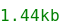
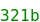

# ecma-core

Ecma-Core is an __Isomorphic__ and __0-dependency__ typed core functions for __Node__ and __browser__.

Library size is min+gzip is about .

No Browser or Node specific code in this lib ! Only __isomorphic__ helpers.

---

## Table of contents
- <a href="#install">Install</a>
- List of available helpers
  - <a href="#operations">Operations</a>
  - <a href="#numbers">Numbers</a>
  - <a href="#paths">Paths</a>
  - <a href="#strings">Strings</a>
  - <a href="#structs">Structs</a>
  - <a href="#time">Time</a>
  - <a href="#some-types">Some types</a>
- <a href="#unpk">Unpkg usage</a>
---

## Install

```bash
npm i @zouloux/ecma-core
```
Module import
```tsx
import { toHex, limitRange } from "@zouloux/ecma-core"
```
CommonJS import
```tsx
const { toHex, limitRange } = require( "@zouloux/ecma-core" )
```

---

## Operations

#### No-op
> No-op is a do nothing handler, typed like any handler `(...rest) => any` for compatibility
```tsx
addEventListener("click", noop) // do nothing
```

#### Compare with operator
```tsx
import { compareWithOperator } from "./operations";
compareWithOperator(2, 5, "<") // true
```
> Available operators
```tsx
export type TCompareOperators = '===' | '==' | '!==' | '!=' | '>=' | '>' | '<=' | '<';
```

---

## Numbers

#### To Hex
```tsx
toHex(16) // 0xF
```

#### UIDs
```tsx
createUID( antiCollectionEntropy = 1, dateEntropy = 1, randomEntropy = 1 )
createUID() // '4c80-489f7937-14f7'
createUID( 0, 0, 1000 ) // only random based '5b3eb'
```

#### Maths
```tsx
// Limit a value into a range of min and max
limitRange( min, value, max )
limitRange( 0, -10, 1 ) // 0
limitRange( 0, +10, 1 ) // 1

// Limite a value into a random of -max and +max
symmetricLimitRange( value, max )
symmetricLimitRange( 10, 2 ) // 2
symmetricLimitRange( -10, 2 ) // -2

// Compute modulo compatible with negative values
positiveModulo( base, modulo )
positiveModulo( 11, 2 ) // 1
positiveModulo( 11, -2 ) // -1

// Move value with offset until 0 or max is reached and loop
circularRange( value, max, offset )
circularRange( 0, 10, 1 ) // 1
circularRange( 0, 10, -1 ) // 9
circularRange( 3, 10, -5 ) // 8
```

#### Geometry
```tsx
// Compute distance between 2 points
distance( x1, x2, y1, y2 )
distanceBetweenPoints( { x: number, y: number }, { x: number, y: number } )

// Compute angle between 3 points
angle3( [{x, y}, {x, y}, {x, y}] )

// From randians to degrees 
radToDeg( angle )
// From degrees to radians
degToRad( angle )

// Limit angle between -Math.PI and + Math.PI 
limitAngle( angle )
limitAngle( Math.PI * 3 ) == -Math.PI
```

#### Random
```tsx
// Random positive number from 0 to max
randomPositive( max )

// Random number from min to max
randomRange( min, max )

// Random number between -max and + max
randomSymmetricRange( max )

// Random sign (-1 or +1)
randomSign()

// Random boolean
randBoolean( threshold = .5 ) // true or false
randBoolean( threshold = .9 ) // Higher change to have true
randBoolean( threshold = .1 ) // Higher change to have false

randomPick(["a", "b"]) // a or b
randomPick(["a", "b", "c", "d"]) // Any value randomly

// Pick a random value from an object
const familly = {
	a: { name: "Pauline" },
	b: { name: "John" },
	c: { name: "Brune" },
}
randomPickFromObject( familly ) // { name: "Brune" }

// Randomize an array
arrayShuffle(["a", "b", "c"]) // ["b", "c", "a"]

// Functional value map, see doc in src/numbers.ts
functionalValueMap( valueMap )
```

---

## Path
> Isomorphic path utils without having to import browserified "path" in the browser.
```tsx
getFileFromPath("./dir/dir/file.ext"); // file.ext

getBaseFromPath("./dir/dir/file.ext"); // ./dir/dir/

extractPathFromBase("/my/base/dir/file.html", "/my/base") // /dir/file.html

removeExtensions("file.config.js") // file.config
removeExtensions("file.config.js", 2) // file

extractExtensions("file.module.less") // ['less', 'module']
extractExtensions("a-folder/") // [] 
```

---

## Strings
#### Check if string is a number
```tsx
isNumber("12") // true
isNumber("") // false
isNumber("0.5") // true
isNumber("1e10") // true
isNumber("0xF1") // true
isNumber("#51") // false
isNumber("NaN") // false
```

#### Zero fill
> Will prepend zeros to match a certain number a chars
```tsx
function zeroFill ( totalChars:number, number:number, placeholder = '0' ) : string {}
zeroFill(2, 1) // "01"
zeroFill(10, 1) // "0000000001"
zeroFill(2, 20) // "20"
zeroFill(4, 14) // "014"
```

#### Trailing and leading
> Add or remove leading or trailing char
```tsx
function trailing ( source:string, add = true, char = '/' ) : string {}
function leading ( source:string, add = true, char = '/' ) : string {}
````

```tsx
trailing("/lib/test") // /lib/test/
trailing("/lib/test/", false) // /lib/test
leading("lib/test") // /lib/test
leading("/lib/test", false) // lib/test
leading(trailing("lib/test")) // /lib/test/
```

#### nl2br
> Same as PHP function, convert \n new lines to <br>
```tsx
nl2br(`
Hi !
`) // <br>Hi!<br>

// And if you need auto closing tag : 
nl2br( multiline, '<br/>') 
```

#### Repeat a char
```tsx
repeat(10, 'a') // "aaaaaaaaaa"
```

#### Indent
```tsx
function indent ( total:number, content = '', tabSize = 0 ) : string {}
indent(3, "Hello", 2) 	// "      Hello" ( 3x2 spaces before the Hello string )
indent(3, "Hello") 		// "			Hello" ( 3 tabs, because tabSize is 0 )
```

#### upperCaseFirst / lowerCaseFirst
```tsx
upperCaseFirst("courgette? Oui!") // "Courgette, Oui!"
lowerCaseFirst("Fromage? Oui!") // "fromage? Oui!"
```

#### dashToCamelCase / camelToDashCase
```tsx
dashToCamelCase("my-string") // "myString"

camelToDashCase("myString") // my-string
camelToDashCase("myString", "_") // my_string
camelToDashCase("myString", "_", true) // MY_STRING
```

#### Slugs
> QuickSlug does not replace special chars
```tsx
quickSlug("This is a test") // "this-is-a-test"
quickSlug("Le fromage rapé") // "le-fromage-rapé" <- still have special chars
quickSlug("With      spaces") // "with-spaces" <- no repeated dashes
```
> Slugify is slower, but it converts special chars to their corresponding ASCII char
```tsx
slugify("This is a test") // "this-is-a-test"
slugify("Le fromage rapé") // "le-fromage-rape" <- spcial chars are replaced !
slugify("With      spaces") // "with-spaces" <- no repeated dashes
slugify("Weird_- -test-héééé-haça@_ test") // "weird_-test-heeee-haca_-test" <- safe string
```

#### Parse query string safely
> Number and boolean are parsed. No support for PHP like array notation.
> Last parameter will pollute first parameters
```tsx
parseQueryString("?test=string&special=With%20spaces&boolean=false&flag")
// {
// 	test: "string",
// 	special: "With spaces",
// 	boolean: false,
// 	flag: true
// }
```

#### Parse booleans
```tsx
function parseBoolean ( booleanAsString:string|number, strict = true, areTrue = ['true'], areFalse = ['false'] ):boolean|null {}

parseBoolean("true") // true
parseBoolean("false") // false
parseBoolean("bla") // null
parseBoolean("bla", false) // false
parseBoolean("y") // null
parseBoolean("n") // null

parseBooleanCLI("y") // true
parseBooleanCLI("yes") // true
parseBooleanCLI("N") // false
parseBooleanCLI("no") // false
parseBooleanCLI("bla") // null
```

#### countStartingChars
```tsx
countStartingChars("	how many tabs ?") // 1
countStartingChars("  how many spaces ?", " ") // 2
```

#### untab
```tsx
function testUntab () {
	return untab(`
		Remove tabs
		From this multi-line text into a function
	`)
}
const string = testUntab();
//'Remove tabs\nFrom this multi-line text into a function'
```

---
## Struct

```tsx
forceArray("ok") // ["ok"]
forceArray(["ok"]) // ["ok"]
```

---
## Time

#### Delay in seconds
```tsx
await delay( 2 ) // wait 2 seconds
```

#### Create delta counter
> Create a counter usable in tick-loops to have time based animations
```tsx
const deltaCounter = createDeltaCounter( baseFrameRate = 1000 / 60 )
function tickBasedLoop () {
	const [ timeFactor, delta ] = deltaCounter()
	// timeFactor -> 1 		If exactly ticked 1 frame later
	// timeFactor -> .5 	If ticked too soon
	// timeFactor -> 2 		If ticked too late (skipped a frame)
	// timeFactor -> 1.222	Realistic values are like this
	// delta -> 16.333		How many ms since last tick ?
}
```

---
## Some types
> Types are exported from their respective module, but here are some examples :
```tsx
type AnyHandler = (...rest) => any|void
type FunctionalFilter <GType> = ( r:GType ) => GType
type ScalarValue = ( string | number | boolean )
type ScalarRecord = Record<string, ScalarValue>
```

---
## Unpkg

Helpers are available on UNPKG.
Import it with a script tag to use it in the browser.
Specify version for better performances (will not check last version at each request).
```html
<script src="https://unpkg.com/@zouloux/ecma-core@0.2.0"></script>
```

- [Whole lib](https://unpkg.com/@zouloux/ecma-core) 
- [numbers only](https://unpkg.com/@zouloux/ecma-core/dist/numbers.es2017.min.js) 
- [operations only](https://unpkg.com/@zouloux/ecma-core/dist/operations.es2017.min.js) 
- [paths only](https://unpkg.com/@zouloux/ecma-core/dist/paths.es2017.min.js) 
- [strings only](https://unpkg.com/@zouloux/ecma-core/dist/strings.es2017.min.js) 
- [structs only](https://unpkg.com/@zouloux/ecma-core/dist/structs.es2017.min.js) 
- [time only](https://unpkg.com/@zouloux/ecma-core/dist/time.es2017.min.js) 